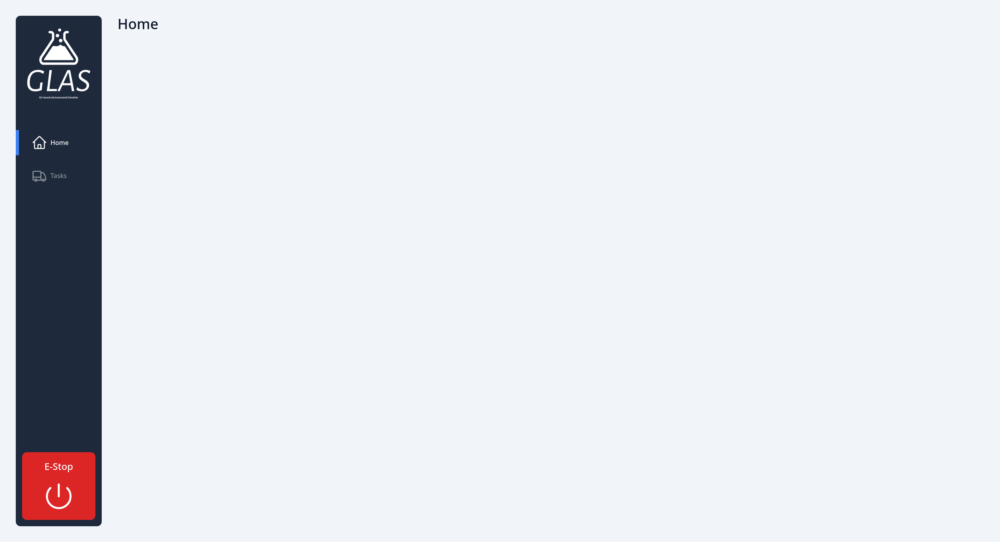
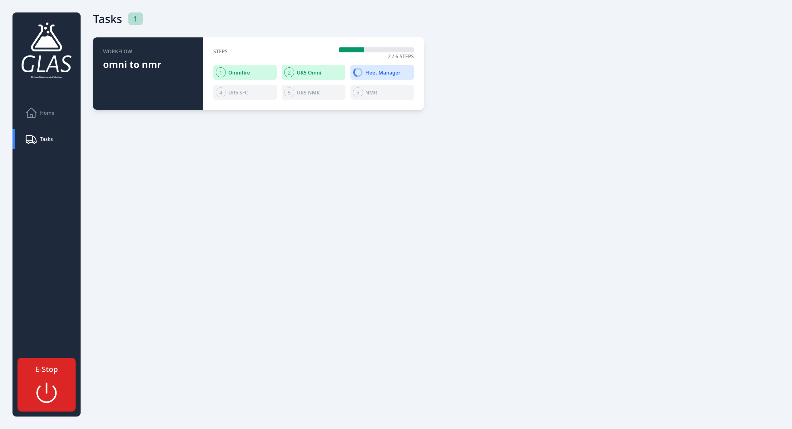

 

  

  <h1 align="center">glas-web-client</h1>

  

    glas-web-client
     
    <a href="https://github.com/swisscatplus/glas-web-client"><strong>Explore the docs »</strong></a>
     
     
  

## Table of Contents

- [Table of Contents](#table-of-contents)
- [Overview](#overview)
- [Installation](#installation)
- [Use](#use)

## Overview
This web client is the near real-time visualizer for the tasks running in [GLAS](https://github.com/swisscatplus/glas).

## Installation

Clone the repository anywhere you want and install the dependencies by running `$ npm i`

## Use

Before running the client, you need to update the base url of the api target with the url of your running GLAS instance, located in the file `src/utils/api.js`.

Finaly, to run the client, simply execute the command `$ npm run dev` and your are good to go. The following screent should be visible:

And when a task is running, you sould see the the `Task` page, something like:

This client can be extended as wanted for your personnal needs.

First, create a new Vue file in the `views` directory. Then, you need to update the router located in `src/router/index.js` to add the newly created page. Finaly, add a NavLink entry in the `App.vue`. 
