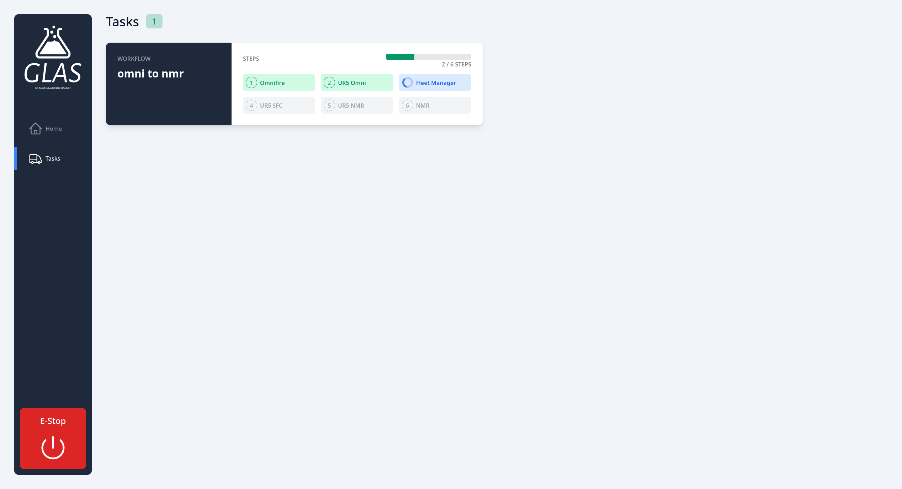

# GLAS Web Client

This web client is the near real-time visualizer for the tasks running in [GLAS](https://github.com/swisscatplus/glas).

## Installation

Clone the repository anywhere you want and install the dependencies by running `$ npm i`

## Usage

Before running the client, you need to update the base url of the api target with the url of your running GLAS instance, located in the file `src/utils/api.js`.

Finaly, to run the client, simply execute the command `$ npm run dev` and your are good to go. The following screent should be visible:

And when a task is running, you sould see the the `Task` page, something like:

